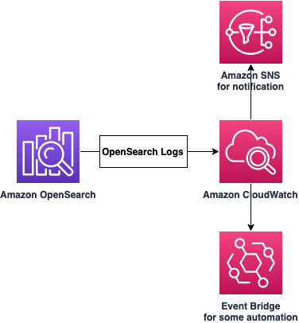

# Monitor Amazon OpenSearch Clusters

## Intro

[Amazon OpenSearch Service](https://aws.amazon.com/opensearch-service/?did=ap_card&trk=ap_card) is an important service for observability, and with the service singularities, like availability, index process, and visualization, it’s necessary to analyse how he is performing.
 With this post, you will know what are the best practices to ensure that your Cluster is performing and how to track the health of your OpenSearch environment.

## Stability Best Practices and Cluster Architecture

The Following Architecture illustrates how the OpenSearch Cluster is organized, what is the function of each part on this architecture, and How Nodes and Storages communicates with each other.

**Dedicated Master Node:**

Amazon OpenSearch service uses Dedicated Master Nodes to increase cluster stability. By default, this option is unable, but you can make able on Cluster first launch or changing the configurations on Cluster that was already launched.
The delegating of the Cluster Management tasks to Master Nodes increase the stability of your domain. 
The minimum Masters Nodes for a production OpenSearch Cluster to meet performance and resilient requirements is three Nodes. See more at [Dedicated Master nodes in Amazon OpenSearch Service](https://docs.aws.amazon.com/opensearch-service/latest/developerguide/managedomains-dedicatedmasternodes.html).

**Data Node and EBS Storage:**

Amazon OpenSearch service uses Data Nodes to access your indexes, each Data Node is one instance with storage. The data stored on Data Node is Hot Storage, where the data uses EBS store for high-speed communication with the instance and the data is accessed with high frequency.
To meet both resilient requirements and performance, the OpenSearch team recommends the minimum two Data Nodes.

**UltraWarm and Cold Storage:**

Amazon OpenSearch service uses UltraWarm to store large amounts of read-only data. "Hot" Storage provides the fastest performance for indexing and searching for new data. UltraWarm Nodes uses Amazon S3 for storage and a solution for caching to improve performance. The UltraWarm is used to store data that is infrequently accessed. See more at [UltraWarm storage for Amazon OpenSearch Service](https://docs.aws.amazon.com/opensearch-service/latest/developerguide/ultrawarm.html).

For data that is also infrequent accessed, historical purpose, or Archive but for the lower cost storage tier, you can use Amazon OpenSearch service Cold Storage. Like UltraWarm, Cold Storage also uses Amazon S3 for storage, but doesn't use the caching solution. If you want to access data that is stored at Cold Storage, you need to attach an UltraWarm node. See more at [Cold storage for Amazon OpenSearch Service](https://docs.aws.amazon.com/opensearch-service/latest/developerguide/cold-storage.html).

## Performance guidelines

To optimize the performance of your OpenSearch Cluster, you can do these recommendations below:

#### Use Bulk API to aggregate your indexes:

OpenSearch can perform actions with hundreds of thousands of data, and to optimize these operations, you can use Bulk API. The Bulk API is a feature on OpenSearch that can perform the aggregation and transformation of your data structure after feed to your dashboards or search engine.

#### Bulk your data after delivery to your OpenSearch Cluster:

OpenSearch does many actions with your data, like indexing, transforming, and bulking. The Bulk API operation can inflict the performance of your Cluster and affect others OpenSearch features performance, like Dashboards and notifications. For use cases that the Bulk API can negatively affect the performance of your cluster, the OpenSearch team recommends the user to use a service to perform the aggregation of the indexes and transformation before delivery to OpenSearch Cluster.
 
To perform bulk and transformation operations, you can use one of these services: 

* Amazon Kinesis Data Firehose,
* Amazon Managed Streaming for Kafka,
* Amazon Simple Storage Service with Lambda,
* Logstash,
* Ingestion,
* OpenTelemetry.

#### Optimize Bulk request size and compression:

Defining the best bulk size for your use case depends on many variables, and to understand the right sizing it’s necessary to test the bulk sizing options, a good staring point is 5-15 MB.
When you change the bulk request sizing, the performance of your cluster will change. When you choose a size that the cluster doesn't get more performative, than this size is a good fit for your use pattern.

#### Tune refresh intervals:

The refresh operation makes all the updates that are performed on an index available for search. The default refresh is 1 second, to improve the performance, you can increase the refresh rate at a period that you can tolerate. 

We recommend setting the refresh_interval parameter for all of your index to 30 seconds or more.

## Monitoring Options

Monitoring is a relevant part of maintaining your applications and reduce the response time when an event occurs in your environment. For example, you can make a better troubleshooting detecting with accuracy where is the issue at your application.

### Amazon CloudWatch metrics

To analyze the health of your OpenSearch Cluster, you can use Amazon CloudWatch. With this service is possible to track metrics, create customized dashboards, and set alarms that notify you or take actions when a metric reaches a certain threshold, like make an API call for example.

#### CloudWatch Logs Insights

[Amazon CloudWatch](https://aws.amazon.com/cloudwatch/?did=ap_card&trk=ap_card) can capture your OpenSearch logs for monitoring the cluster healthy.

Amazon OpenSearch can generate three types of logs and send through Amazon CloudWatch logs.
After explaining the OpenSearch log types, it’s important to say some concepts. Amazon OpenSearch cluster uses Apache Log4j 2, and this library uses some log levels of TRACE, DEBUG, INFO, WARN, ERROR, and FATAL (from least to most severe).

* Error logs - When you enable this type, OpenSearch sends log level of WARN, ERROR, and FATAL to CloudWatch when an error is triggered. OpenSearch can send some exceptions from the DEBUG level as well.

Error logs can help with troubleshooting in many situations, including invalid queries, indexing issues, snapshot failures, Index State Management Migration failures, and Painless script compilations issues.

To Enable error logs at your cluster, see [Monitoring OpenSearch logs with Amazon CloudWatch Logs](https://docs.aws.amazon.com/opensearch-service/latest/developerguide/createdomain-configure-slow-logs.html).

* Slow logs - This type is used to detect performance issues at your OpenSearch cluster. After enabling this log, it’s necessary to figure out how much is "slow” search or indexing for your business context.

These logs have two types, one focused on search slow logs and the other for indexing slow log.

To enable slow logs at your cluster, see the [OpenSearch documentation about logs](https://opensearch.org/docs/latest/monitoring-your-cluster/logs/#slow-logs).

* Audit logs - Enabling [fine-grained access control](https://docs.aws.amazon.com/opensearch-service/latest/developerguide/fgac.html) at your OpenSearch cluster, you can enable audit logs for your data as well. With audit logs, you can track the user activities at your cluster, like authentication success and failures, requests to OpenSearch, index changes, and incoming search queries.

The default configuration tracks the most popular set user actions, but is recommended to use the log setting that fit to your business needs.

To enable audit logs at your cluster, see [Monitoring audit logs in Amazon OpenSearch Service](https://docs.aws.amazon.com/opensearch-service/latest/developerguide/audit-logs.html).

#### CloudWatch Alarms

When you send your OpenSearch logs through Amazon CloudWatch, you can perform some actions with this data. One action that you can do is alarms. With CloudWatch alarms, you can send a notification, trigger other service, or make an API call.
For more information about the alarm types that you can use with OpenSearch logs and CloudWatch Alarms, see [Recommended CloudWatch Alarms for Amazon OpenSearch Service](https://docs.aws.amazon.com/opensearch-service/latest/developerguide/cloudwatch-alarms.html).

## Open-source Observability Tools

#### Amazon Managed Grafana

[Amazon Managed Grafana](https://aws.amazon.com/grafana/) is a fully managed and secure data visualization service that you can use to instantly query, correlate, and visualize operational metrics, logs, and traces from multiple sources.
Grafana integrates with Amazon CloudWatch to query and visualize the cluster metrics that OpenSearch Service sends. Some logs that OpenSearch sends are cluster status, CPU Utilization, Free Storage Space, and OpenSearch Dashboards Healthy Nodes. See the complete list at [Monitoring OpenSearch cluster metrics with Amazon CloudWatch](https://docs.aws.amazon.com/opensearch-service/latest/developerguide/managedomains-cloudwatchmetrics.html).

## Auditing and Governance

**AWS CloudTrail Logs**

Amazon OpenSearch Service integrates with AWS CloudTrail, a service that provides a record of actions taken by a user, role, or an AWS service in OpenSearch service. CloudTrail captures all configuration API calls for OpenSearch Service as events. See more at [Monitoring Amazon OpenSearch Service API calls with AWS CloudTrail](https://docs.aws.amazon.com/opensearch-service/latest/developerguide/managedomains-cloudtrailauditing.html). 

